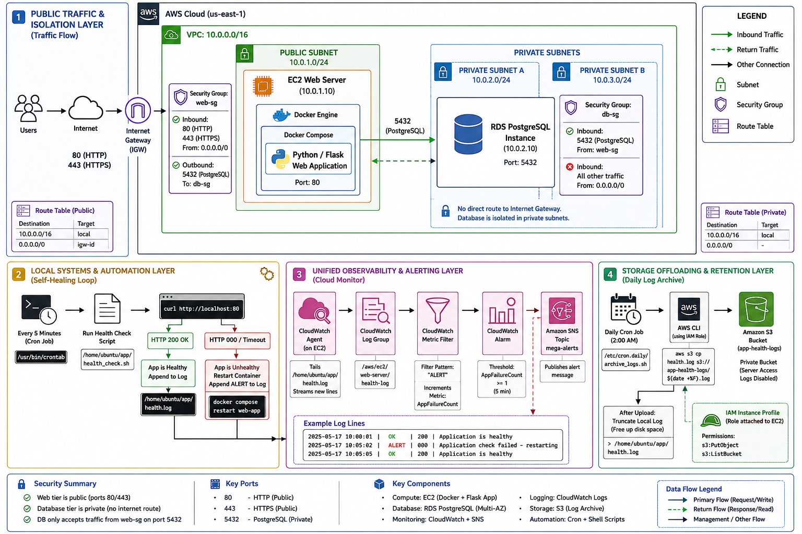

# AWS Self-Healing Web Deployment

A multi-tier web infrastructure on AWS built to automatically detect and recover from application failures without manual intervention. Designed with network isolation, container automation, and real-time alerting focused.

---

## What This Does

When the Flask web application crashes or becomes unreachable, the system:
1. Detects the failure within 5 minutes via a cron-driven health check
2. Automatically restarts the Docker container (recovery in under 3 seconds)
3. Logs the event to CloudWatch and triggers an SNS email alert
4. Sends a second "OK" email once the system confirms recovery

No operator action required for container-level failures.

---

## Architecture



### Layer 1 — Network & Data Isolation

- Custom VPC with separate public and private subnets
- EC2 instance (Ubuntu) in the public subnet hosts the Flask app in a Docker container
- RDS PostgreSQL placed in a private subnet with no internet route — only reachable from the app tier
- Security Groups configured with identity-based rules: the database security group (`db-sg`) allows port 5432 only from `web-sg`, not from any IP range. This means even if another EC2 exists in the same VPC, it cannot reach the database unless it carries the web security group identity.

> Why Security Groups over NACLs? NACLs are stateless and subnet-wide. Security Groups are stateful and instance-specific, which gives tighter, more precise control at the resource level.

### Layer 2 — Health Check & Self-Healing Loop

A cron job runs `health_check.sh` every 5 minutes on the EC2 host. The script sends a `curl` request to `localhost:80` and checks the HTTP response code:

- `200` → logs an OK entry
- Anything else (timeout, `000`, 5xx) → logs an `ALERT` entry and runs `docker compose restart web-app`

```bash
#!/bin/bash
LOG_FILE="/home/ubuntu/app/health.log"
STATUS_CODE=$(curl -s -o /dev/null -w "%{http_code}" --max-time 5 http://localhost:80)

if [ "$STATUS_CODE" -eq 200 ]; then
    echo "[$(date "+%Y-%m-%d %H:%M:%S")] OK | 200 | Application is healthy" >> "$LOG_FILE"
else
    echo "[$(date "+%Y-%m-%d %H:%M:%S")] ALERT | $STATUS_CODE | Application check failed - restarting" >> "$LOG_FILE"
    cd /home/ubuntu/app && /usr/local/bin/docker-compose restart web-app
fi
```

### Layer 3 — Observability & Alerting

- CloudWatch Agent tails `health.log` and streams entries to a CloudWatch Log Group in real time
- A Metric Filter scans for the string `ALERT` and increments a custom metric (`AppFailureCount`)
- A CloudWatch Alarm monitors this metric and publishes to an SNS topic on state changes
- Two emails are sent: one when the alarm triggers (`ALARM` state), one when the system recovers (`OK` state)

---

## Engineering Problems Solved

These are the two real issues I hit during build not theoretical edge cases.

### Problem 1: SNS emails were silently dropping

**Symptom:** Logs were streaming to CloudWatch correctly and alarms were triggering, but no emails arrived.

**Root cause:** The SNS topic had default Server-Side Encryption (SSE) enabled. This blocked the CloudWatch service principal from calling `sns:Publish` because the KMS key policy did not grant that principal access.

**Fix:** Updated the KMS key policy to explicitly allow the CloudWatch service principal (`cloudwatch.amazonaws.com`) to use the key for publish operations. This is a non-obvious IAM/KMS interaction — the SNS console shows no error, and CloudWatch shows the alarm as firing correctly, which makes it hard to diagnose.

---

### Problem 2: CloudWatch alarm stuck in "Insufficient Data"

**Symptom:** The alarm would briefly go red, then immediately freeze in `Insufficient Data` instead of recovering to `OK`.

**Root cause:** The Docker container was restarting so fast (under 3 seconds) that only a single 1-minute data point was recorded before the metric went silent. CloudWatch treats missing data points as `null` by default, which causes the alarm to enter `Insufficient Data` rather than `OK`.

**Fix:** Configured the Metric Filter to emit a value of `0` when no `ALERT` string is found in the log stream. This creates a continuous baseline metric even during healthy periods, so CloudWatch always has data to evaluate and can correctly transition between `ALARM` and `OK` states.

---

## Tech Stack

| Component | Service / Tool |
|---|---|
| Compute | AWS EC2 (Ubuntu 22.04) |
| Application | Python / Flask |
| Containerization | Docker, Docker Compose |
| Database | AWS RDS (PostgreSQL), private subnet |
| Networking | VPC, Security Groups, Internet Gateway |
| Monitoring | AWS CloudWatch Agent, Log Groups, Metric Filters |
| Alerting | CloudWatch Alarms, Amazon SNS |
| Automation | Bash, Linux Cron |

---

## Known Limitations

- Self-healing works at the **container level only**. If the EC2 host itself goes down, there is no automatic recovery, this would require an Auto Scaling Group with a launch template.
- Health check runs every 5 minutes (cron limitation). A tighter loop would need a persistent process like a systemd service or a dedicated monitoring tool.
- No IaC (Terraform/CloudFormation) — infrastructure was provisioned manually via AWS Console. Adding IaC is the next planned improvement.

